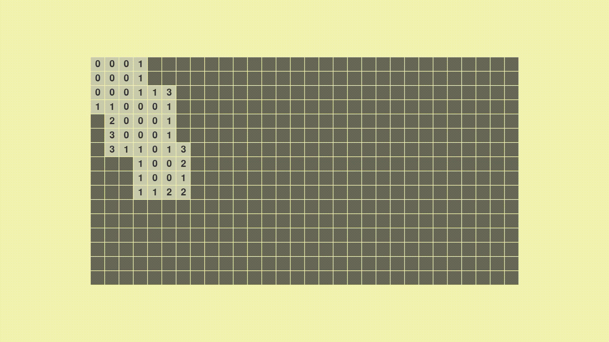

# Minesweeper AI

This is my attempt at writing a minesweeper AI (not a neural-network) that will solve a minesweeper field using logic.

I don't know how other minesweeper bots work, nor do i know theory, so the naming of some techniques might be odd.

*The code is pretty bad, i'm sorry*

## Techniques implemented

- [x] Single cell technique
*Simply looks at a single cell independately*
- [x] Two cells technique
*Looks at two neighboring cells, uses common cells to get more information*
- [ ] Adaptive groups technique
*The knowledge from two cells technique should be saved and used later*
- [ ] Minecount
*Sometimes a field that seems to be 50/50 can be solved using the amount of mines remaining*

I don't know if i will ever continue though xd

## Demo

